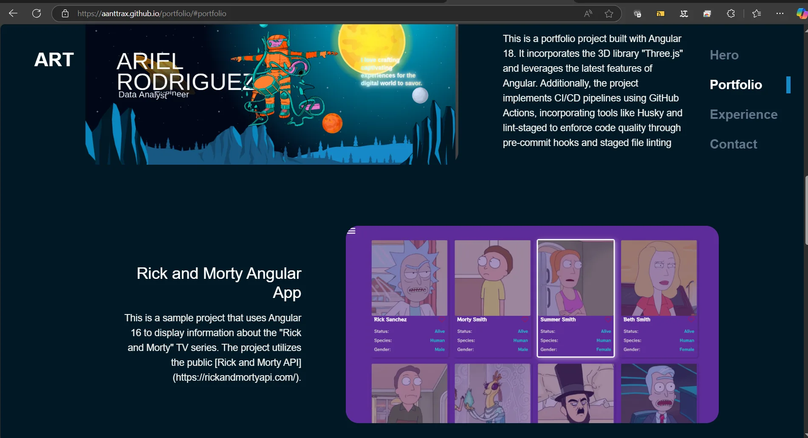

# Portfolio v1.0.0 Angular 18



This is a portfolio project built with Angular 18. It incorporates the 3D library "Three.js" and leverages the latest features of Angular. Additionally, the project implements CI/CD pipelines using GitHub Actions, incorporating tools like Husky and lint-staged to enforce code quality through pre-commit hooks and staged file linting. The project is located in [Portfolio Site](https://aanttrax.github.io/portfolio/).

## Screenshots


## Features

- List of Experiences.
- Projects details.
- Send Email and contact.

## Requirements

- [Node.js](https://nodejs.org/) installed on your system.
- [Angular CLI](https://cli.angular.io/) installed globally.

## Installation

Follow these steps to install and run the application:

1.  Clone the repository:

    ```bash
    git clone https://github.com/Aanttrax/portfolio.git
    ```

2.  Navigate to the project directory:

    ```bash
    cd portfolio
    ```

3.  Install the dependencies:

    ```bash
    npm install
    ```

4.  Start the application:

    ```bash
    npm start
    ```

5.  Open your browser and go to http://localhost:4200/.

## Contribution

If you want to contribute to this project, feel free to open issues and submit pull requests.

## Contact

You can contact the project author at Arielrt20@gmail.com or Arielrt_@hotmail.com

<!-- ng add @ngx-env/builder -->
